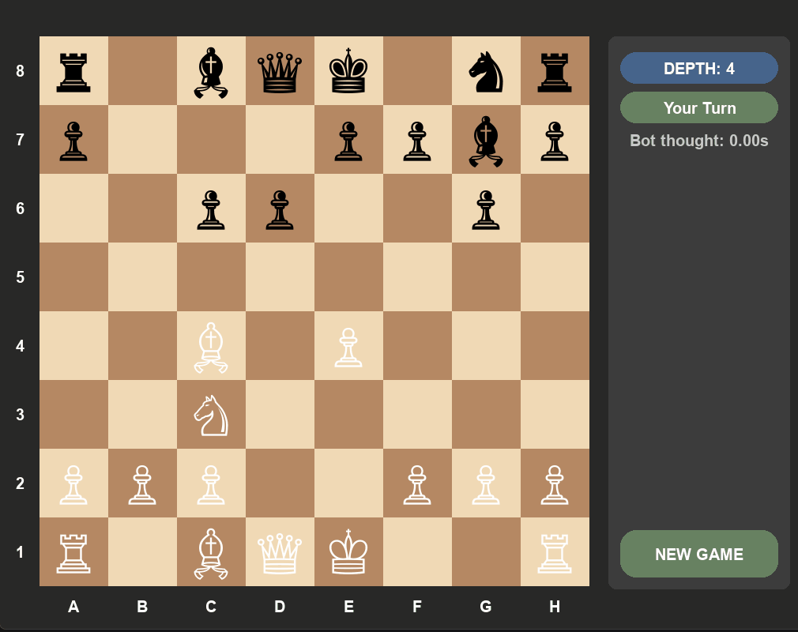

# Chess PyEngine



A complete chess engine and playable graphical interface written from scratch in Python. 
The project features a heavily optimized Minimax search, custom piece-square tables, 
and an opening book trained on master-level games.

---

## Engine Features

- **Minimax with Alpha-Beta pruning:** The core search algorithm. Captures are ordered before quiet moves, which increases the number of branches pruned and lets the engine search deeper in the same amount of time.
- **Quiescence Search:** At the search horizon, the engine avoids evaluating immediately. Instead, it continues searching capture sequences until the position is stable. This prevents the "horizon effect" where the engine might otherwise blunder pieces. The **standing pat** condition lets it stop early if the position is already good enough without capturing.
- **Transposition Tables:** Optimizes the search tree by caching already evaluated positions using Zobrist hashing. This eliminates redundant calculations and allows the engine to reach higher depths in less time. To ensure perfect accuracy, it utilizes distinct hash tables based on the side to move.
- **Piece-square tables:** Built by replaying 100,000 master games from the [Lichess Elite Database](https://database.nikonoel.fr/) and recording how often each piece type sat on each square, split into opening, midgame, and endgame. Starting squares are down-weighted so unmoved pieces don't get an inflated bonus.
- **Opening Book:** Maps Zobrist hashes to weighted move dictionaries. Weights come from how often each reply appeared in the dataset, so the engine samples from real theory rather than always playing the most common move.
- **Dynamic Search Depth:** Search depth increases automatically as material leaves the board to calculate deeper into the endgame.

---

## Stack

- **Python 3**
- **Pygame** (Graphical Interface)
- `python-chess` (for PGN parsing in dataset scripts only)
- `pytest` (for unit testing)

---

## Project Structure

```text
Chess/
├── assets/
│   └── gameplay.gif     # demo animation for README
├── data/
│   ├── book.json
│   ├── book.py          # builds opening book from PGN
│   ├── pst.json
│   └── pst.py           # builds PST from PGN
├── model/
│   ├── pieces/          # move generation per piece type
│   ├── board.py         # board state, move logic, Zobrist hashing
│   ├── bot.py           # Minimax engine
│   ├── enums.py
│   └── utils.py
├── tests/
│   ├── test_board.py
│   ├── test_bot.py
│   └── test_pieces.py
├── game.py              # Game GUI logic
├── main.py
└── README.md
```

---

## Setup & Usage

```bash
pip install pygame python-chess pytest
python main.py
```

You play as White. Click a piece to select it, then click a destination square. The engine will automatically respond.
## Running tests
```bash
python -m pytest tests/ -v
```

## Retraining the datasets (Optional)
To retrain on a different PGN file:

```bash
python data/book.py
python data/pst.py
```

---

## Future Roadmap

* **Neural Network Evaluation:** Implementing a shallow neural network to replace or augment the current heuristic-based PST evaluation for more accurate positional scoring.
* **Enhanced GUI:** Upgrading the Pygame interface to include game mode selection, adjustable difficulty levels, and a move history log.
